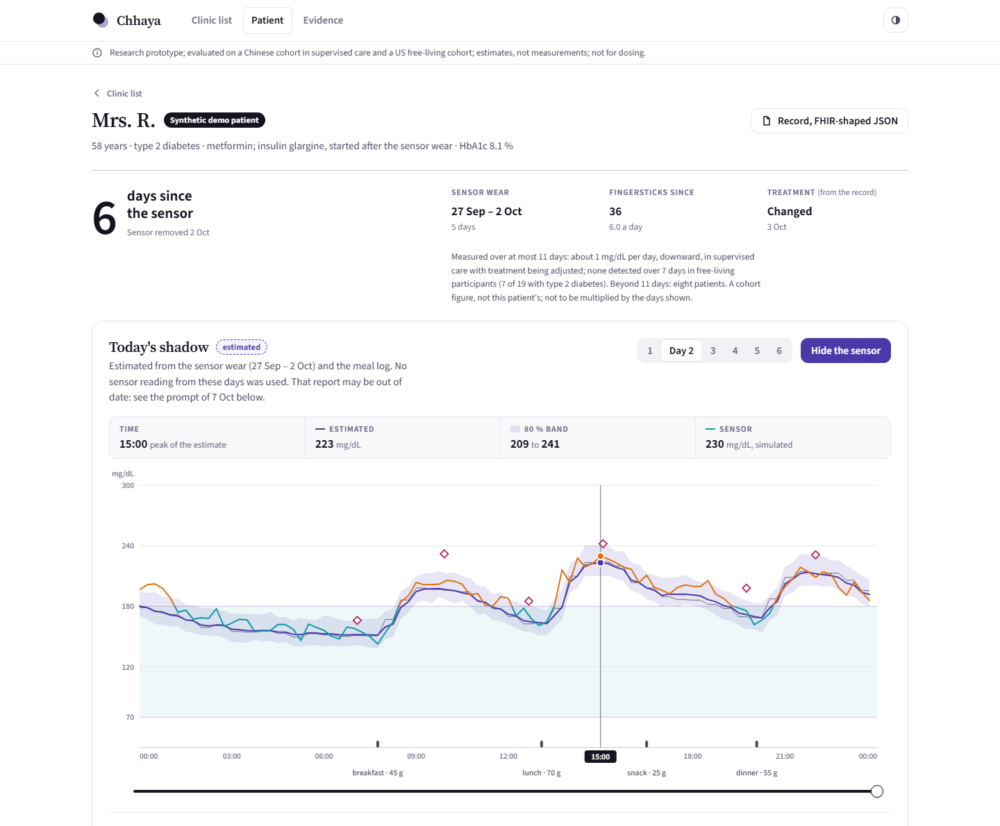
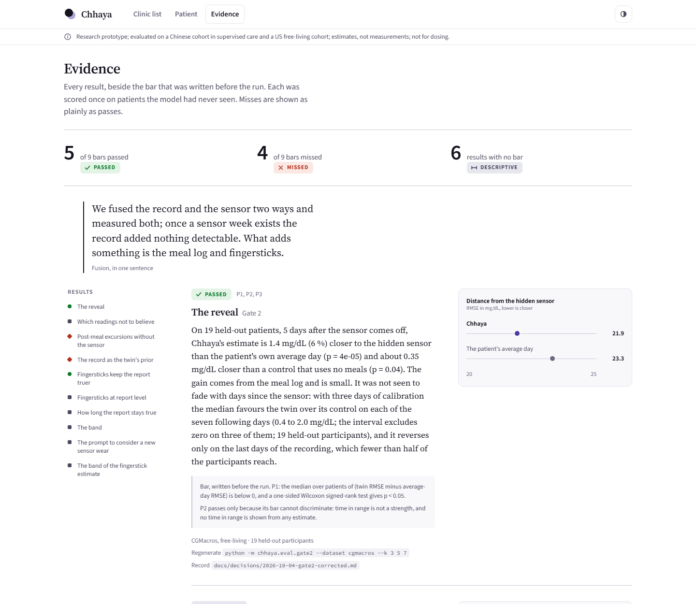
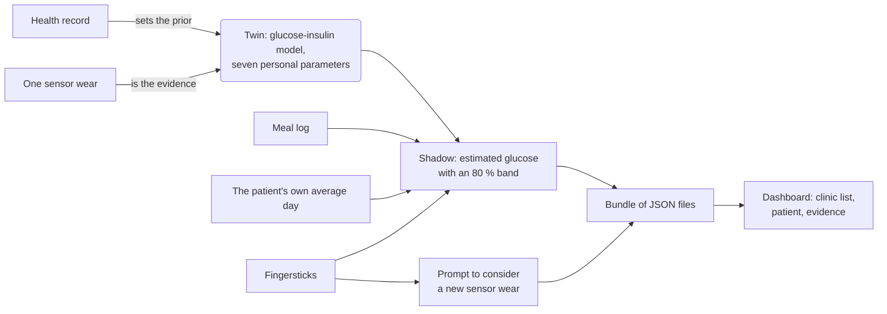

<div align="center">

# Chhaya

### A diabetes digital twin that shows its work.

**One glucose-sensor wear, turned into the patient's shadow, with a scorecard written before the results.**

[](LICENSE)


Entry to the **Happiest Health Digital Twin Challenge 2026** · Team **SynapseX**, IIT Kanpur · submission folder `SynapseX_IITK`

</div>

<p align="center"></p>

<p align="center"><sub><b>Mrs. R., a synthetic patient, on day 2 after her sensor came off.</b> Purple: Chhaya's estimate and its 80 % band, drawn without the sensor. Teal and amber: the real sensor, revealed on top. By day 6, after a change of treatment, the band holds 4 % of her readings and the dashboard raises a prompt to consider a new sensor wear. Both are in the demo; she is simulated and labelled so on screen.</sub></p>

## The hook

A glucose sensor lasts 14 days and costs about Rs 4,200 in India, so almost nobody with Type 2 diabetes wears one for long. A patient wears it once, gets a report, and is treated from that report for months. **Nobody tells the doctor how old the report has become.**

So we asked the question every digital twin claims to answer, and held ourselves to a standard almost none do:

> Calibrate on a few days of sensor data. **Hide the rest.** Estimate the hidden days without the sensor. Then lay the real trace on top.

Before each run we wrote down what would count as success. **Nine bars were set in advance. Five passed. Four missed, and they are on this page.** Where a plain baseline beat our model, we say so. What survived is smaller than a pitch deck would claim and every number of it can be regenerated with one command.

## What we found

Each result was scored once on held-out patients, a half of each cohort that no setting was ever tuned on. This table is a summary; each claim's full wording, with its caveats, is in the next section.

| | Result | Bar written beforehand | Outcome |
|---|---|---|---|
| **The reveal** | Five days after the sensor comes off, the estimate is 1.4 mg/dL (6 %) closer to the hidden sensor than the patient's own average day (p = 4e-05, 19 participants). The gain comes from the meal log and is small | Closer than the average day, p < 0.05 | **Passed** |
| **Fingersticks keep the report truer** | 2.8 mg/dL closer to the hidden sensor as fingersticks arrive, 9.5 in hindsight, 0.3 with one a day (29 patients) | Closer than the daily shape alone, p < 0.05 | **Passed** |
| **Which readings not to believe** | 8 of 64 sensor lows were confirmed by a fingerstick taken within 10 minutes; 732 of 809 sensor highs were | none | Descriptive |
| **Post-meal excursions without the sensor** | Fusing the record, the sensor week and fingersticks reaches AUPRC 0.60. The patient's own excursion rate reaches 0.59, fingersticks alone 0.64 (47 patients) | Fusion beats every single stream and the personal rate | **Missed** |
| **The record as the twin's prior** | It changed the error by 0.02 mg/dL with one day of sensor data (p = 0.16, 20 participants) | Lower error with the record, p < 0.05 | **Missed** |
| **Fingersticks at report level** | Our rebuilt report missed mean glucose by 8.9 mg/dL. The plain fingerstick average on the sensor's scale missed by 6.4; the stale three-day report by 13.0 | none | Descriptive: a plain baseline beats us |
| **How long a report stays true** | About 1 mg/dL per day, downward, over at most eleven days in supervised care; none detected over a week in free-living participants. These data do not give a number of days | none | Descriptive |
| **The 80 % band of the twin** | It held 83.5 % of hidden readings on average and 60 % to 98.5 % for an individual. A recalibration did not transfer and is not used | none | Descriptive |
| **The band of the fingerstick estimate** | It held 83.6 % of hidden sensor readings (49.9 % to 98.9 % for an individual) at about 45 mg/dL each side: right on average, and wide | none | Descriptive |
| **A prompt to consider a new sensor wear** | It told drifted from stable reports with AUROC 0.82 (interval 0.63 to 0.98). Comparing the fingerstick average with the report did as well (0.82) | none | Descriptive: a plain baseline does as well |

Bars and their dated amendments: [docs/PREREGISTRATION.md](docs/PREREGISTRATION.md).

**Fusion, in one sentence:** we fused the record and the sensor two ways and measured both; once a sensor week exists the record added nothing detectable. What adds something is the meal log and fingersticks.

## The dashboard

Three screens, built to be read in ten seconds by a doctor: **who has an old sensor report**, **what one patient's shadow looks like beside the real trace**, and **every result beside its bar, misses included**. It runs offline from pre-computed files; nothing is fitted while it runs.

```bash
uv sync
uv run python -m chhaya.dashboard        # opens http://127.0.0.1:8765, no datasets needed
```

<p align="center"></p>

- **Honest uncertainty is the design.** An estimate is never drawn without its band and the word "estimated". A sensor low reads "sensor low, unconfirmed", because most were not.
- **The reveal is the interaction.** The shadow comes first; the real sensor then slides over it.
- **No dose advice, no low-glucose estimate, no alarm.** The prompt to consider a new sensor wear is a prompt about the report, never a finding about the patient.
- With the datasets and the cache built locally, `python -m chhaya.build --real --confirm` adds every held-out patient (49 in all) to a private local bundle.

## What Chhaya is not

- It does not replace a sensor. Against the next fingerstick the estimate is about 22 % off where a real sensor is about 12 %.
- It has no low-glucose estimate and raises nothing on lows: in the open data most sensor lows were not confirmed by a fingerstick.
- It recommends no dose. The dashboard only simulates a meal the doctor enters.
- It shows no time in range from an estimate, and no HbA1c from fingersticks.
- It does not claim that fusing the record with the sensor improves anything we measured.
- It gives no rule for when a patient should wear a sensor again.

## Why you can trust the numbers

These rules are what separate this from a model validated on its own simulator. They are in [CLAUDE.md](CLAUDE.md) and enforced by tests.

1. **No leakage.** In the hidden window the twin may read meals, a wrist band and fingersticks, never the sensor. Every evaluation asserts that scored readings lie after the calibration split, and every feature builder has a test that changes the hidden sensor and checks that nothing else moves.
2. **Split by patient, never by row.** One half of the patients tunes every setting; the other half is scored once, by a command that needs `--confirm` and committed code.
3. **Bars are written before the run.** Changing one afterwards means a dated amendment that says so.
4. **Misses are published.** A failed fit is a row with an error, not a dropped patient.
5. **Every claim is checked against its record.** The sentences on the Evidence screen are tested word for word against the decision records in [docs/decisions/](docs/decisions/).
6. **Synthetic is labelled synthetic.** The demo patient "Mrs. R." and any genetic-marker field are simulated; neither open dataset has genotypes.

## How it works



- **The twin** is the published E-DES glucose-insulin model with a circadian term, in JAX, with seven personal parameters. The record sets their prior; the sensor wear is the likelihood. Calibration is a MAP fit with a Laplace ensemble for the band.
- **The estimate is a blend**: half physiology, which knows what was eaten today, and half the patient's own average day, which knows the habits a meal log misses.
- **Fingersticks** nudge the estimate through a filter whose effect fades over about two hours, and feed a running comparison with the sensor wear's daily pattern. Its band is the filter's own spread, scaled by the patient's own spread about their daily shape.

Why this concept and what the other entries do: [docs/WAR_ROOM.md](docs/WAR_ROOM.md). Where the project stands: [docs/PROGRESS.md](docs/PROGRESS.md).

### The claims in full

<details>
<summary><b>The reveal</b> (Gate 2, passed)</summary>

On 19 held-out patients, 5 days after the sensor comes off, Chhaya's estimate is 1.4 mg/dL (6 %) closer to the hidden sensor than the patient's own average day (p = 4e-05) and about 0.35 mg/dL closer than a control that uses no meals (p = 0.04). The gain comes from the meal log and is small. It was not seen to fade with days since the sensor; with three days of calibration the median favours the twin over its control on each of the seven following days (0.4 to 2.0 mg/dL; the interval excludes zero on three of them; 19 held-out participants), and it reverses only on the last days of the recording, which fewer than half of the participants reach.

Records: [Gate 2, corrected run](docs/decisions/2026-10-04-gate2-corrected.md), [expiry](docs/decisions/2026-10-08-expiry.md). Time in range is not a strength of the estimate and is never shown from it.
</details>

<details>
<summary><b>Which readings not to believe</b> (label check, descriptive)</summary>

Of 64 sensor readings below 70 mg/dL with a fingerstick within 10 minutes, 8 (12.5 %) were confirmed, and 0 of 9 at night; of 809 sensor readings above 180, 732 (90.5 %) were confirmed.

Regenerate: `python -m chhaya.data.audit`. This is why Chhaya has no low-glucose estimate and why a sensor low on its screens reads "sensor low, unconfirmed".
</details>

<details>
<summary><b>Fingersticks</b> (passed)</summary>

On 29 held-out Shanghai patients, calibrated on three days of sensor data, fingersticks taken afterwards brought the running estimate 2.8 mg/dL closer to the hidden sensor than the patient's daily shape alone (median paired RMSE difference; 95 % interval 1.6 to 4.7; 86 % of patients; p = 4e-06) and 9.5 mg/dL closer in hindsight (interval 4.6 to 12.1); with one fingerstick a day the running gain was 0.3 mg/dL.

To be told with it: the filter was chosen on development patients by a criterion other than the plan's written rule (dated note in the registration, before the test run), and the estimate is still about 22 % off the next fingerstick where a real sensor is about 12 %. Record: [fingersticks](docs/decisions/2026-10-08-fingersticks.md).
</details>

<details>
<summary><b>Post-meal excursions without the sensor</b> (Gate 3, missed its bars)</summary>

On 47 held-out Shanghai patients (1,205 meals, 39 % followed by an excursion above 180 mg/dL), a model fusing the record, the sensor week and fingersticks predicted the excursion at meal time with AUPRC 0.60, which was not better than any single stream (fingersticks only: 0.64) nor than the patient's own excursion rate from the sensor week (0.59; difference 0.01, 95 % interval -0.09 to 0.14); with the sensor on, the same model reaches 0.76.

Record: [Gate 3](docs/decisions/2026-10-08-gate3.md). There is no meal alert.
</details>

<details>
<summary><b>The record as the twin's prior</b> (missed its bar)</summary>

On 20 held-out CGMacros patients with one day of sensor data, giving the twin the record's fasting glucose as its prior changed the error of the estimate by a median of 0.02 mg/dL (p = 0.16), and with three or more days by nothing measurable: the record, as it enters the twin today, is not worth any sensor days.

Record: [record prior](docs/decisions/2026-10-08-record-prior.md).
</details>

<details>
<summary><b>Fingersticks at report level</b> (descriptive; a plain baseline beats our estimator)</summary>

On 29 held-out Shanghai patients under supervised care who were tested about six times a day, with the hidden sensor as the yardstick, a three-day sensor report missed the mean sensor glucose of the following days (up to eleven) by a median of 13.0 mg/dL. Chhaya's report rebuilt in hindsight from those fingersticks missed it by 8.9 (median paired difference 3.4, 95 % interval 1.6 to 8.9, 83 % of patients), but was no closer than the plain average of the same fingersticks converted to the sensor's scale by a line learned during the wear (6.4). The share of those converted readings above 180 mg/dL and within 70 to 180 was also closer to the sensor's time above 180 and time in range (3.1 against 8.8 points; 5.0 against 15.2). As read from the meter the same average lay 18.3 mg/dL from the sensor's mean; sensor-scale figures are not meter values. Lower testing frequencies were not measured, and this is not a recommendation to test at any frequency.

Record: [fingersticks at report level](docs/decisions/2026-10-08-fingersticks-report.md).
</details>

<details>
<summary><b>How long a report stays true</b> (expiry, descriptive)</summary>

"Report" means mean glucose only, and a three-day report stands in for a fourteen-day one. On 47 held-out Shanghai patients under supervised care with treatment being adjusted, a day's mean sensor glucose lay a median of 13.5 mg/dL from a three-day sensor report's mean inside the wear and 11 to 16 on the four days after it; inside each patient that distance grew by 1.0 mg/dL per day (95 % interval 0.7 to 2.6) over at most eleven days, with glucose moving downward. On 19 held-out free-living CGMacros participants (7 with type 2 diabetes; medication not recorded) no growth was detected over seven days (0.1 mg/dL per day, interval -0.8 to 0.8). In a case series of eight Shanghai patients recorded again (nine later wears, five beginning within three days of the first sensor coming off and four 33 to 154 days after it), four wears in three patients had a mean more than 20 mg/dL lower, all four with a change of treatment in the files; of the five that had not moved, four had no change and one had, and the old daily profile fitted them no worse than a fresh one. No test; not a rule for when a patient should wear a sensor.

Record: [expiry](docs/decisions/2026-10-08-expiry.md).
</details>

<details>
<summary><b>The 80 % band of the twin</b> (descriptive; the recalibration did not transfer)</summary>

On 19 held-out participants the 80 % band held 83.5 % of hidden readings on average and between 60 % and 98.5 % for an individual, with 10 of 19 participants within 70 to 90 %. A recalibration factor chosen on development patients (0.78) moved the average to 75.7 %, further from 80 % than before, so it is not used: the band is calibrated on average, not per patient.

Record: [band](docs/decisions/2026-10-08-band.md).
</details>

<details>
<summary><b>The band of the fingerstick estimate</b> (descriptive)</summary>

Descriptive, no bar. On 29 held-out Shanghai patients under supervised care, calibrated on three days of sensor data and tested about six times a day, a band built from the fingerstick filter's own spread and each patient's spread during the sensor wear, with nothing fitted, held 83.6 % of hidden sensor readings around the running estimate (49.9 % to 98.9 % for an individual; 12 of 29 patients within 70 to 90 %) and 86.1 % around the estimate in hindsight (56.7 % to 100 %), at a half-width of about 45 mg/dL. It is calibrated on average, not per patient, and it is wide.

Record: [stickband](docs/decisions/2026-10-09-stickband.md).
</details>

<details>
<summary><b>A prompt to consider a new sensor wear</b> (descriptive; a plain baseline does as well)</summary>

On 32 held-out Shanghai recordings (29 patients under supervised care, tested about six times a day, for up to eleven days after a three-day sensor report), 11 of which drifted by more than 20 mg/dL in mean sensor glucose (9 downward, 2 upward), a running sum of fingerstick surprises, used only as a prompt to consider a new sensor wear, separated drifted from stable recordings with AUROC 0.82 (95 % interval 0.63 to 0.98), against 0.82 (0.61 to 0.97) for the plain fingerstick average compared with the report's mean (difference 0.00, interval -0.16 to 0.18): it was not shown to do better than that comparison. At a threshold set on development recordings so that at most 10 % of stable ones would raise it, the prompt was raised in 7 of 11 drifted recordings (64 %) and 2 of 21 stable ones (10 %); in those 7, a median of 2.6 days after the split. With a five-day report (24 recordings, 6 drifted) it was not shown to separate them (0.67, interval 0.35 to 0.92). The label and the score look back over the same days. It is not a finding about a patient's glucose, not advice on treatment and not a rule for when to wear a sensor, and it was not tested in outpatient care, at lower testing frequencies or over longer periods.

Record: [staleness](docs/decisions/2026-10-08-staleness.md).
</details>

## Reproduce everything

```bash
uv sync
uv run pytest -q                                           # the full suite
uv run python -m chhaya.data.download shanghai cgmacros    # 3.7 MB + 627 MB, checksum-verified
uv run python -m chhaya.data.audit                         # dataset counts and the label check
uv run python -m chhaya.eval.gate2 --dataset cgmacros --k 3 5 7
```

Each later result has one command. It reads held-out patients only with `--confirm`, once, on committed code; the results are in `results/`.

```bash
uv run python -m chhaya.eval.gate3 --confirm                 # post-meal excursions: missed its bars
uv run python -m chhaya.eval.fusion                          # the record as the twin's prior: missed
uv run python -m chhaya.eval.fingersticks --confirm          # fingersticks after the sensor: passed
uv run python -m chhaya.eval.fingersticks_report --confirm   # the same, at the level of a sensor report
uv run python -m chhaya.eval.expiry shanghai --confirm       # also: cgmacros, cases
uv run python -m chhaya.eval.calibrate --confirm             # the twin band's recalibration: did not transfer
uv run python -m chhaya.eval.stickband --confirm             # the band of the fingerstick estimate
uv run python -m chhaya.eval.staleness --confirm             # the prompt to consider a new sensor wear
uv run python -m chhaya.build                                # the dashboard's demo bundle
uv run python -m chhaya.build --real --confirm               # plus every held-out patient, kept local
uv run python -m chhaya.dashboard                            # the dashboard
```

## What we used and keep private, and why

Some of what went into this project is deliberately not in the repository. Each item is named here so nothing is hidden by omission.

| What | What we used it for | Why it is not published |
|---|---|---|
| **The two datasets** (`data/`) | Everything: calibration, scoring, the label check | Not ours to redistribute. CGMacros is CC BY-NC-SA, non-commercial; ShanghaiT2DM is CC BY 4.0 but we fetch both by script, with checksums, rather than copy them. `python -m chhaya.data.download` brings them in |
| **Per-reading traces of real patients** (`data/derived/traces`, `artifacts/`) | The held-out patients on the local dashboard, and the by-day results | Per-reading data of real people is patient data, not an aggregate. Only derived aggregates are committed (`results/`). The committed demo bundle and any hosted copy carry the synthetic patient only |
| **Real names** | Nowhere | The datasets contain none. Names on screen are pseudonyms given by Chhaya, with the dataset's own identifier beside them, and the dashboard says so |
| **The coding assistant's local setup** (`.claude/`, `.agents/`, `skills-lock.json`) | Building and reviewing the code with Claude (Anthropic) under the rules in `CLAUDE.md` | It is tooling, not method: third-party skill files with their own licences, and local settings. The rules the assistant worked under are public in `CLAUDE.md`, and every decision it helped make is in `docs/decisions/` |

## Limits

No Indian data. Shanghai is supervised care with treatment being adjusted. Hidden windows are at most eleven days, plus eight patients recorded again up to 168 days later (a case series, not a rule). The effect of the physiology is about 2 %. The prompt was not shown to do better than comparing the fingerstick average with the report, and was not tested in outpatient care. Both bands are calibrated on average, not per patient, and the fingerstick band is wide. The model has no exogenous insulin, no drug kinetics and no counter-regulation. The Clarke error grid used in the fingerstick experiment is the widely used reference implementation, not checked against the 1987 figure.

## Data and licences

Code: MIT. Datasets are downloaded by the user and never redistributed; only derived aggregates are in this repository.

- **ShanghaiT2DM**: 100 patients with Type 2 diabetes, 109 recordings, supervised care. CC BY 4.0 (Zhao et al., Scientific Data 2023).
- **CGMacros**: 45 free-living participants. CC BY-NC-SA 4.0, non-commercial use only (PhysioNet, doi 10.13026/3z8q-x658).
- **Fonts** in the dashboard (Source Sans 3, Source Serif 4, Source Code Pro): SIL Open Font License 1.1, in [`OFL.txt`](src/chhaya/dashboard/static/fonts/OFL.txt).

## Repository map

- `src/chhaya/` the package: data loaders, the twin (model, calibration), evaluation, the dashboard build and server
- `tests/` the test suite; synthetic patients with known true parameters
- `results/` every reported number, as written by the commands above
- `docs/PREREGISTRATION.md` the bars, fixed before each run, with dated amendments
- `docs/decisions/` one record per result, each with its "claim to quote"
- `docs/superpowers/` the roadmap, designs and task-level plans
- `CLAUDE.md` the project's rules and conventions

## Team

**SynapseX**, IIT Kanpur: a solo entry. Built with Claude (Anthropic) as a programming and review assistant, working under the rules in `CLAUDE.md`; every equation, split and bar is the team lead's to explain.
